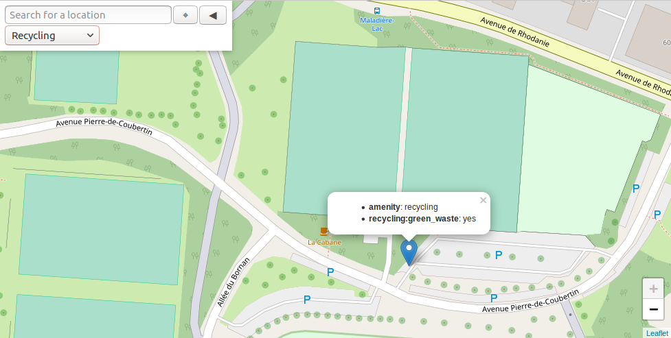
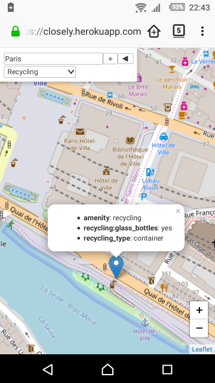

# closely

*Closely* shows useful amenities close to your position. Use it when travelling to find a nice picnic site,
drinking water, toilets, etc.

The application is available [online](https://closely.herokuapp.com) for free. It uses OpenStreetMap for
the map tiles, and [taginfo](https://taginfo.openstreetmap.org/) to know about the amenities.

The application looks like the following:

On the top left panel you can:

- Look for a location to display (e.g. “Paris”),
- Use your current location,
- Hide the panel,
- Select the kind of amenity to show on the map.

On mobile devices, I recommend using the “add to home screen” feature (house with a plus button):

Clicking on the hous with a plus button will add a shortcut to the web app on your home screen,
for quicker access.

## Contributing

Contributions are welcome! You can contribute in two ways. First, indirectly, by
[tagging places on OpenStreetMap](https://wiki.openstreetmap.org/wiki/Contribute_map_data). Second, by
contributing to the source code of closely.

Here are some examples of possible contributions:

- Add a new kind of amenities to the list,
- Improve the rendering of the tooltips (currently they simply show the list of tags),
- Create a proper mobile app.

### Build from source

Install [sbt](https://scala-sbt.org).

Run the project with the following command (it has to be executed from the root directory):

~~~
$ sbt run
~~~

And then browse http://localhost:9000.

## License

This content is released under the [MIT License](http://opensource.org/licenses/mit-license.php).
